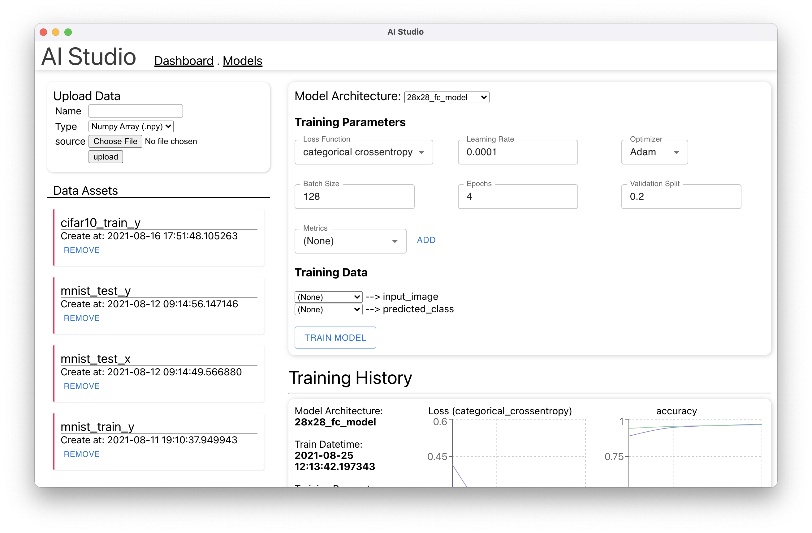
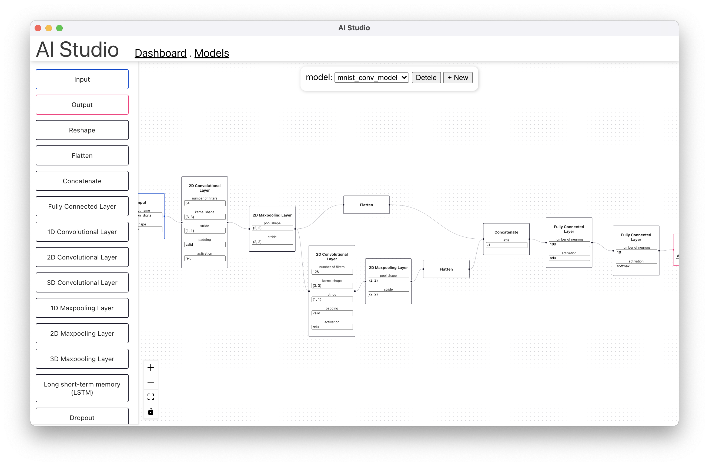
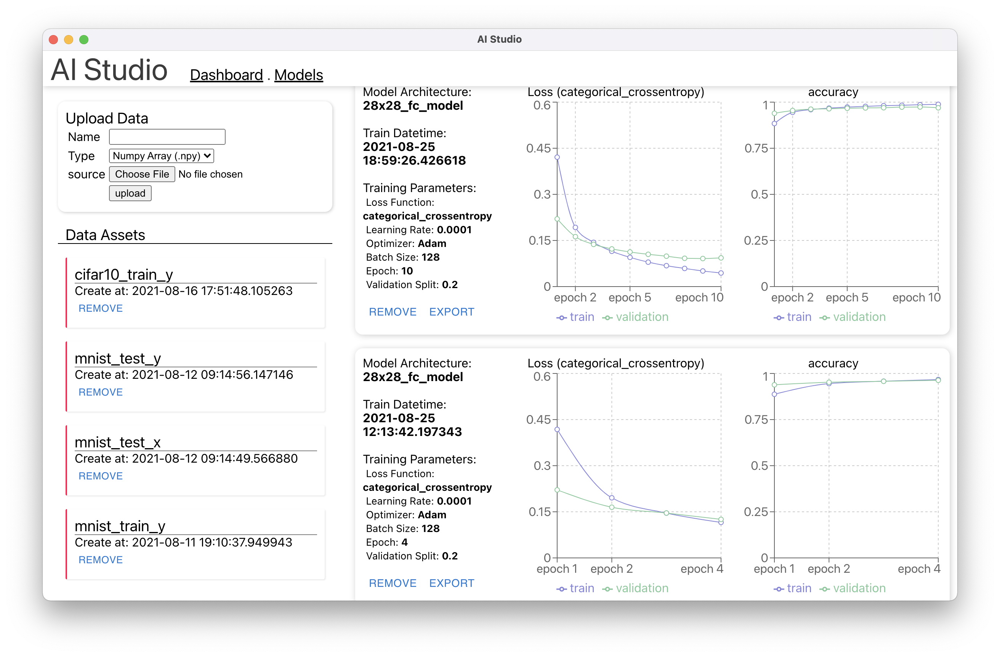

# DataFlow

General purposed no-code ML

A web app that let people easily build, train, compare/debug, and deploy ML models with a drag-and-drop flowchart

(Backend is not uploaded here. Email juliantc@stanford.edu for the complete version)

Website https://ai-studio.org (MacOS version downloadable)

Watch Demo: https://youtu.be/0VIelEJyQlQ

(Formerly named as AI Studio)

